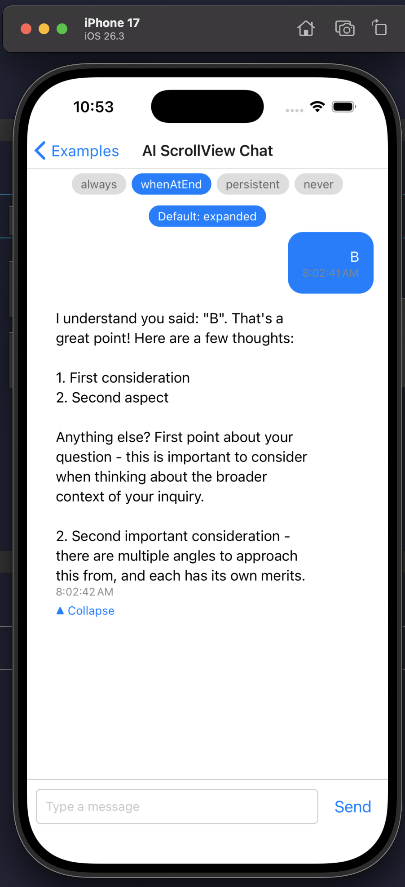
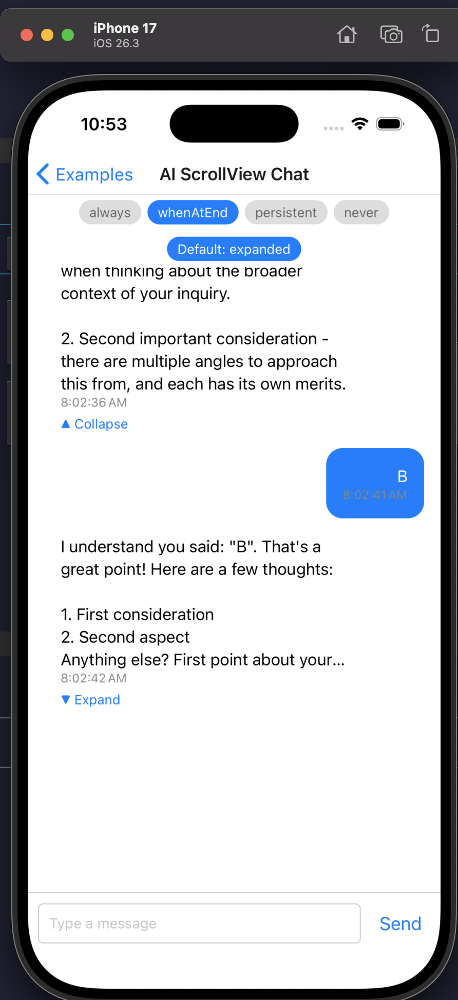
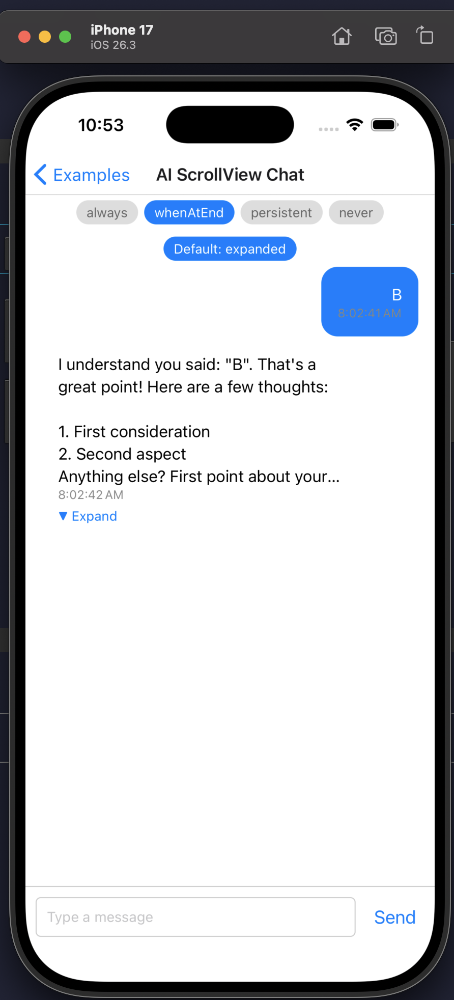

# Handoff: collapse layout-shift bug in `blankSpace` (AI ScrollView Chat)

> Fresh-start handoff. **Do not** assume any prior fix approach is correct — start
> from the symptom and the mechanism below. Fix **iOS first**; the bug also
> reproduces on Android.

## Symptom

Screenshots (iPhone 17 sim):

| 1. Before (tap target) | 2. Broken intermediate | 3. Desired (after manual scroll) |
| --- | --- | --- |
|  |  |  |

In the **"AI ScrollView Chat"** example (`FabricExample`), with `liftBehavior =
whenAtEnd` and an expanded AI reply that fills the viewport (user message pinned
at the top of the screen):

1. **Before** — tap target state. The last user message is at the top of the
   viewport; its expanded AI reply fills the rest of the screen. (screenshot 1)
2. **Tap "Collapse"** — the AI reply shrinks. Instead of staying anchored, the
   content **shifts downward**: the previous (older) AI reply scrolls into view
   from the top and the user message drops to the middle of the screen.
   (screenshot 2 — the broken intermediate state)
3. The user can then **manually scroll to the end** and it looks correct: user
   message back at the top, collapsed reply below it, blank space filling the
   bottom. (screenshot 3)

**Desired:** tapping Collapse in state (1) should land directly on state (3) with
**no** visible layout shift / scroll jump. The user message should stay anchored
at the top of the viewport across the collapse.

This is the same in reverse for some Expand cases — worth checking once Collapse
is fixed.

## How the feature works (mechanism)

The example file
`FabricExample/src/screens/Examples/AIScrollViewChat/index.tsx` drives a
`blankSpace` shared value:

```
blankSpace = max(0, scrollViewHeight - contentBelowAnchor)
```

- `anchorToTopIndex` = index of the **last user message** (set on send).
- `contentBelowAnchor` = sum of measured heights of messages from the anchor to
  the end (`messageSizes` map, filled by each row's `onLayout`).
- `blankSpace` is passed to `KeyboardChatScrollView` and ends up as **bottom
  padding** (part of scrollable content height) so the anchor message can sit at
  the top of the viewport even when there isn't a full screen of content below
  it.
- iOS uses `maintainVisibleContentPosition={{ minIndexForVisible: 0 }}`; Android
  passes `undefined` for that prop.

`recalculateBlankSpace` is called from:
- the row `onLayout` (when a message's measured height changes), and
- the scroll view `onLayout`, and
- a `useEffect` on `[messages, anchorToTopIndex]`.

## Why the shift happens (hypothesis to verify, not gospel)

When the reply collapses:

1. The reply view shrinks → `contentBelowAnchor` drops → the row `onLayout`
   recomputes and **grows** `blankSpace` to compensate.
2. But the **content shrink** and the **blankSpace (padding) grow** are not
   atomic. In the window between them, total content height briefly drops, and
   the scroll view clamps / reflows the scroll offset to the smaller content,
   producing the visible downward shift before padding catches up.
3. The "preserve the absolute scroll offset" model does not hold the *visual*
   position when `blankSpace` (which lives inside scrollable height) resizes
   relative to that offset. Holding absolute offset ≠ holding the on-screen
   anchor.

The real fix likely needs to keep the **anchor child** visually pinned across the
content-size + inset change (true MVCP-style anchoring), or to make the
shrink+padding-grow atomic, rather than restoring a saved scalar offset.
**Verify this hypothesis on-device before committing to an approach.**

## File map

### Example (where `blankSpace` is computed)
- `FabricExample/src/screens/Examples/AIScrollViewChat/index.tsx`
  - `recalculateBlankSpace` — lines ~170–191
  - `doSendMessage` sets anchor — lines ~250–278
  - `KeyboardChatScrollView` usage (props incl. `blankSpace`,
    `maintainVisibleContentPosition`, `onLayout`) — lines ~371–391
  - per-row `onLayout` → recompute — lines ~395–403
  - `AIResponse` collapse/expand via `numberOfLines` + `onToggle` — lines ~82–103
- `FabricExample/src/screens/Examples/AIScrollViewChat/styles.ts`

### Core JS components
- `src/components/KeyboardChatScrollView/index.tsx` — clamps total padding to one
  viewport; splits keyboard padding vs `extraContentPadding`; emits
  `bottomPadding`.
- `src/components/KeyboardChatScrollView/types.ts` — `blankSpace` prop docs (~77–91).
- `src/components/ScrollViewWithBottomPadding/index.tsx` — applies dynamic bottom
  padding via animated props (iOS: `contentInset`/`scrollIndicatorInsets`/
  `contentOffset`; Android: `contentInsetBottom`/`contentInsetTop`). RN 0.81+
  `contentInset` hit-test workaround.
- `src/components/KeyboardChatScrollView/useChatKeyboard/` — keyboard handler;
  `index.ios.ts` is the iOS variant. `helpers.ts` has the blankSpace-absorption
  worklets.
- `src/components/KeyboardChatScrollView/useExtraContentPadding/` — scroll
  adjustment on `extraContentPadding` changes.

### Native
- iOS: under `ios/` — **the specific native file handling scroll-offset behavior
  during content-size/inset change was NOT yet located.** Needs to be found
  (search the iOS scroll view subclass / MVCP implementation). This is a likely
  home for the iOS fix.
- Android: `android/src/main/java/com/reactnativekeyboardcontroller/views/ClippingScrollViewDecoratorView.kt`
  (Android-only; deprioritized for now).

### Tests (write/adjust only after on-device fix works)
- `src/components/KeyboardChatScrollView/useChatKeyboard/__tests__/blankSpace.ios.spec.ts`
- `src/components/KeyboardChatScrollView/useExtraContentPadding/__tests__/blankSpace.spec.ts`

## Repro steps (iOS)

1. Build/run `FabricExample` on the **iPhone 17** simulator (drive via the
   `agent-device` skill).
2. Open **Examples → AI ScrollView Chat**.
3. Ensure `liftBehavior = whenAtEnd` (default) and `Default: expanded`.
4. Send a message that produces a long reply (type `b` or `c`) so the expanded
   reply fills the screen with the user message at the top.
5. Tap **Collapse** on the latest AI reply.
6. **Bug:** content shifts down (older content appears at top). **Want:** user
   message stays anchored at top, blank space fills the bottom — no jump.

## Constraints / notes

- Fix **iOS first**, then port to Android.
- Don't worry about unit tests until it works on the device.
- VCS is **Jujutsu (jj)**, not git — use `jj` for any state-changing VCS ops.
- Build/iterate command for the native example is recorded in the
  `fabricexample-native-iterate` memory.

## Explicitly out of scope / discarded

A previous Android-only attempt (saved-scalar-offset restore: `repinToEnd`,
`holdScrollRange`, `restoreScrollY`, etc. in the Kotlin decorator) was abandoned
as the wrong model — it could not hold the visual anchor when `blankSpace`
resizes. **Do not resurrect that approach from memory.** Start from the
mechanism above and validate on-device.
